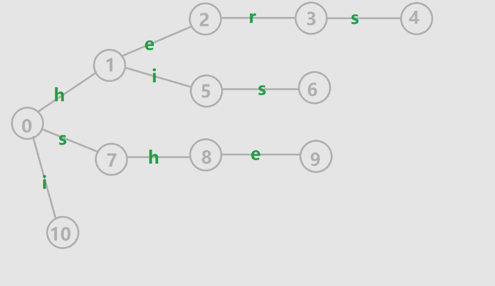
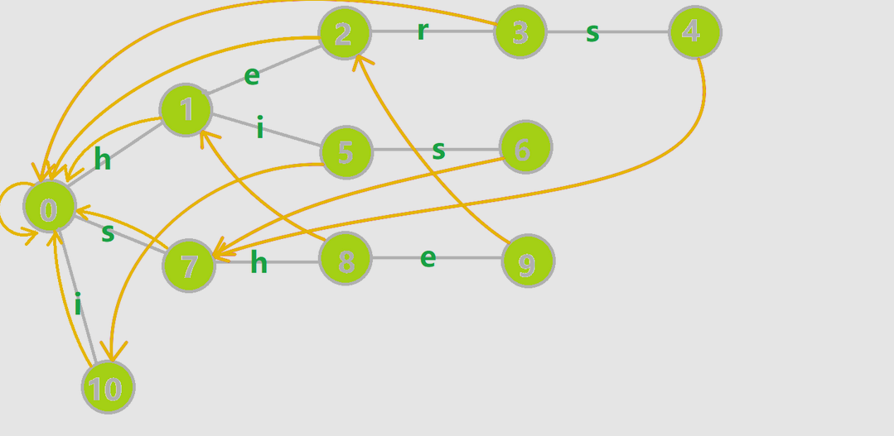

更新于 2024 年 9 月 9 日。
# AC 自动机的运作原理

大二刚开始，第二节课讲了 AC 自动机。在高中搞信息学竞赛时听说过，但一直没有学或用到过（因为我太菜了）。

为了加深对 AC 自动机的理解，我在这里讲一下自己的理解。

## 前置知识

在学习 AC 自动机之前，建议先掌握以下内容：
- **Trie 树**
- **KMP 算法**

掌握 KMP 算法可以更好地理解 AC 自动机，因为 AC 自动机是 KMP 算法的扩展，它将处理从单模式串扩展到多模式串。

AC 自动机由 **Trie 树** 实现，区别在于 AC 自动机比普通的 Trie 树多了一个 **fail 指针**。接下来我们会一步步解释 fail 指针的作用。

<!--more-->

## AC 自动机的构建

首先，根据所有模式串构建一个 Trie 树。例如，以下是模式串：
`hers`、`his`、`she`、`he`、`i`



构建 Trie 树的代码可以参考常见模板，这里不再赘述。

## AC 自动机的 fail 指针

`fail 指针` 是 AC 自动机的核心，用于指向当前节点的失配状态。

**失配指针** 的作用：当我们把文本串的字符逐个输入 AC 自动机时，如果某个字符匹配失败（即失配），我们会根据 fail 指针跳转到一个新的状态，并继续进行匹配。

### 匹配过程模拟

以下是一个已经构建好的 AC 自动机。我们来模拟匹配过程：



假设我们要匹配的文本串是 `hishers`，从根节点开始依次输入字符，匹配的过程如下：

1. **输入** `h`，匹配成功，状态从 $0 \to 1$，当前状态为 `h`。
2. **输入** `i`，匹配成功，状态从 $1 \to 5$，当前状态为 `hi`。
3. **输入** `s`，匹配成功，状态从 $5 \to 6$，匹配到 `his`，当前状态为 `his`。
4. **输入** `h`，匹配失败，fail 指针指向状态 7，跳转至状态 `s`（$6 \to 7$），重新匹配 `h`。
5. **输入** `h`，匹配成功，状态从 $7 \to 8$，当前状态为 `sh`。
6. **输入** `e`，匹配成功，状态从 $8 \to 9$，匹配到 `she`，当前状态为 `she`。
7. **输入** `r`，匹配失败，fail 指针指向状态 2，跳转至状态 `he`（$9 \to 2$），重新匹配 `r`。
8. **输入** `r`，匹配成功，状态从 $2 \to 3$，当前状态为 `her`。
9. **输入** `s`，匹配成功，状态从 $3 \to 4$，匹配到 `hers`，当前状态为 `hers`。

通过这个过程，我们可以看到，每次失配时，都会跳转到当前状态的最长后缀。例如，从 `she` 跳转到 `he`。

### Fail 指针的作用

因此，fail 指针的作用是：**在所有状态中找到一个状态 $v$，使得 $v$ 是当前状态的后缀，且 $v$ 是最长的后缀**。

类似于 KMP 算法，如果 AC 自动机只由一个模式串构成，其匹配过程与 KMP 算法非常相似。

## Fail 指针的构建

以下是 fail 指针构建的代码实现：

```cpp
void BuildFail() {
    queue<int> q; // 用队列来实现 BFS
    for (int i = 0; i < 26; i++) { // 初始化根节点的所有子节点的 fail 指针
        if (tr_[0].children[i]) {
            q.push(tr_[0].children[i]);
        }
    }

    while (!q.empty()) {
        int cur = q.front();
        q.pop();
        for (int i = 0; i < 26; i++) {
            int &child = tr_[cur].children[i]; // 当前节点的子节点
            int fail = tr_[cur].fail; // 当前节点的 fail 指针

            if (child) { // 如果当前节点的子节点存在
                tr_[child].fail = tr_[fail].children[i]; // 子节点的fail指针指向当前节点fail指向的节点的对应字符子节点
                q.push(child);
            } else {
                child = tr_[fail].children[i]; // 如果没有子节点，把子结点设置为fail指针所指向的节点
            }
        }
    }
}
```

### 代码讲解：

1. 我们使用 **BFS** 来遍历所有节点，并逐步设置每个节点的 `fail` 指针。
2. 对于每个节点，如果当前字符的子节点存在，就让该子节点的 fail 指针指向父节点的 fail 节点的对应子节点。
3. 如果当前节点没有子节点，则将子结点节点设置为 fail所指向的节点，这样可以保证永远可以通过 fail 指针跳转。

